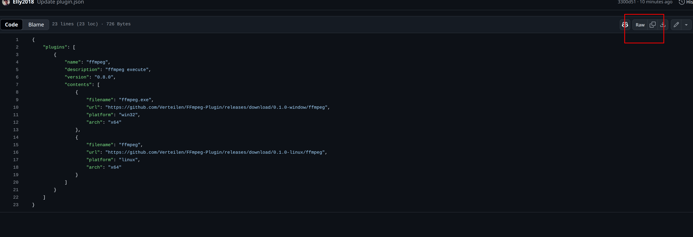
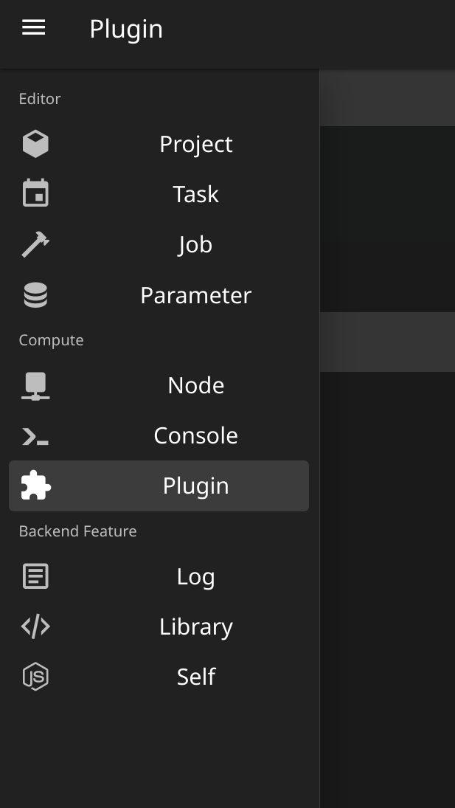
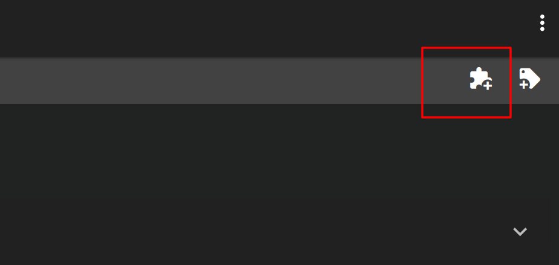
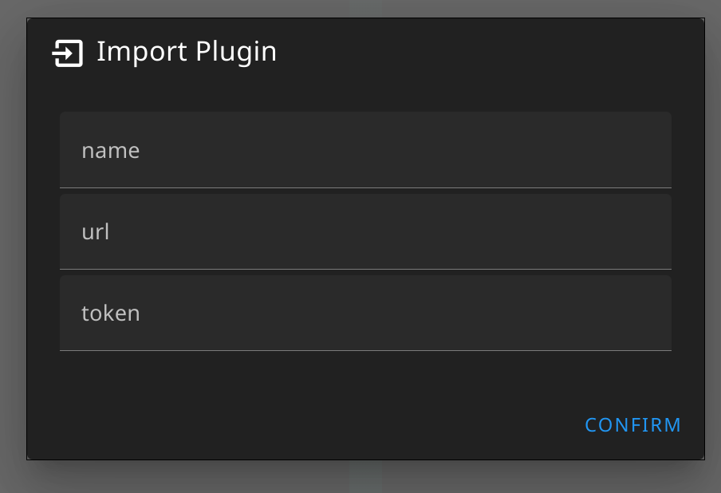
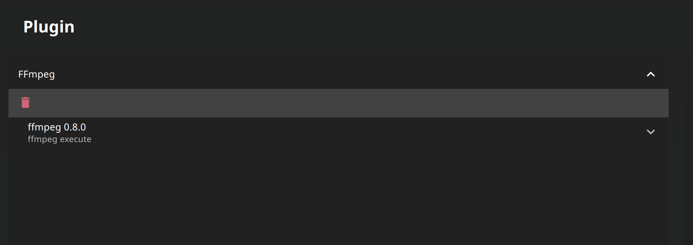
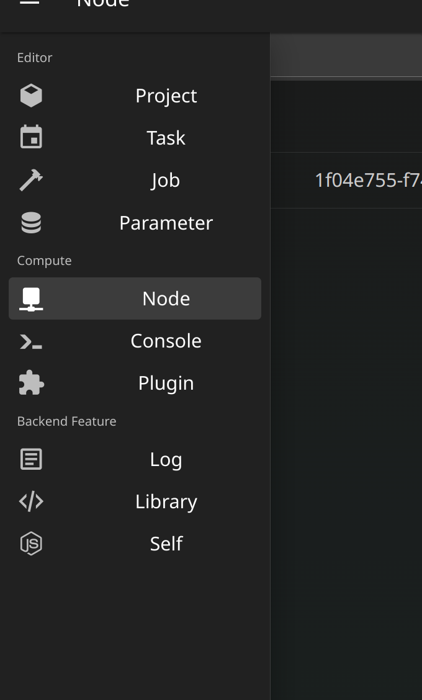
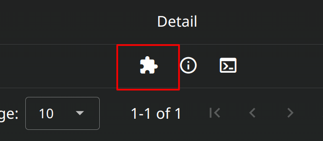
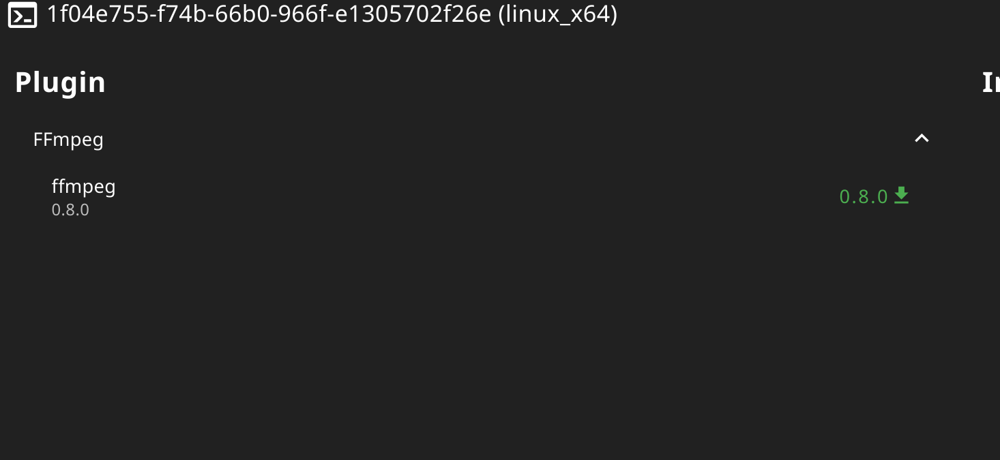

# Plugin-FFmpeg

The ffmpeg executable files plugin

## Import

In the github repo page, click the json file to preview, Click upper-right corner raw button to see the raw json data

Then copy the url link

You will get [https://raw.githubusercontent.com/Verteilen/FFmpeg-Plugin/refs/heads/main/plugin.json](https://raw.githubusercontent.com/Verteilen/FFmpeg-Plugin/refs/heads/main/plugin.json)

Then let's open up the application, go the plugin page to import

Click plugin import button on the upper-right corner

Enter the json link to url field and click confirm\
And if you're reference the private repo you will need token\
More detail in [Here](https://docs.github.com/en/authentication/keeping-your-account-and-data-secure/managing-your-personal-access-tokens)

Wait a bit, And you can see it in the list now

> [!NOTE]
> The config you just download will store in the application folder\
> path: {root}/data/plugin

## Install

Now we can tell the node to download the executable file, base on the config we just import

Let's go to node manage page 

Check the node you want to manage, and click plugin manage

Now you can manage the plugin this way, there are three actions for this page
* Install
* Update
* Uninstall

